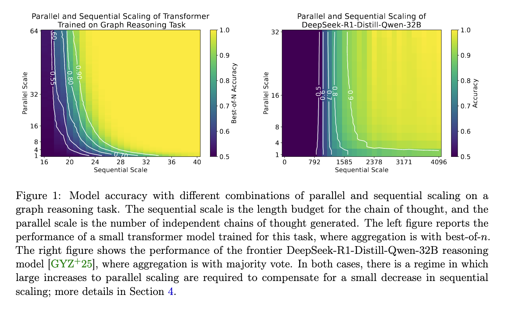

# Let me think!



## Running the code
1. Generate the dataset
```bash
python gen.py --num_train 500000 --num_val 5000 --graph_type flower --depth 5 --short 3 --long 5 --dead 3 --task_type decision --st_pair far --search_types optimal,dfs,path,dfs-pruned,walks-20-50-5
```
2. Train the model after scpecifying configs in the config folder.
```bash
python train.py # you can also run a wandb sweep using configs/sweep.yaml
```
3. Evaluate the models 
```bash
python eval/extract.py --retrieve --depth 5 # after specifying wandb and sweep id at eval/config
python eval/eval.py --depth 5 --no-sample
python eval/eval.py --depth 5 --scale --log_num_trials 5
python eval/eval.py --depth 3 --scale --until_learns
python eval/eval.py --play --depth 5 --sample --teaches path
```

4. RL on the path model
```bash
 python train.py --teach path-play-1 --resume_depth 5 # specify path-play-1 file in eval/config/d5.yaml
 python train.py --teach path-play-2 --resume_depth 5
 python train.py --teach path-play-3 --resume_depth 5
 python train.py --teach path-play-4 --resume_depth 5
```

## Repository Structure Overview
### `configs/`
- `training_config.yaml`: Training configuration.
- `model_config.yaml`: Model configuration.
- `accelerate.yaml`: Accelerator configuration.


### `.`
- `gen.py`: Dataset generation logic.
- `train.py`: Training logic.
- `eval`: Evaluation logic and config.
- `analysis`: Analysis logic.
- `mission.py`: Mission class definition.
- `utils.py`: Helpful methods.
